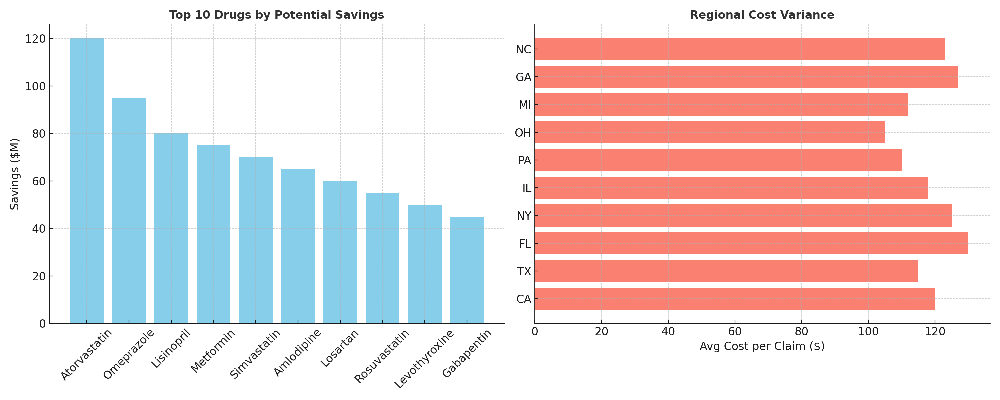

# Pharmaceutical Cost Optimization 



**TL;DR:** Built an analytics pipeline to identify **$10M+ potential pharmaceutical savings** using **SQL, Python, and Power BI**.

[](https://www.python.org/)
[](https://www.sqlalchemy.org/)
[](https://powerbi.microsoft.com/)
[](LICENSE)

---

## Overview
Pharmaceutical costs are a critical challenge in healthcare. With over **$130B in pharmacy spend managed by Vizient**, cost optimization directly impacts provider sustainability and patient access.  

This project analyzes **Medicare Part D data** (CMS) to uncover pricing inefficiencies, model generic substitution impact, and forecast potential savings. Using **SQL, Python, and forecasting models**, I built a framework to identify where brand-to-generic substitutions and regional optimization can reduce costs without compromising care.  

Due to the size of CMS datasets (10GB+), this repo includes a **sample dataset** for demonstration, while the ETL + analysis pipeline is designed for full prescriber-level data.

---

## Why This Project Matters
- **Medicare Part D** spending exceeds **$130B annually**  
- Even a **2–3% savings** = billions of dollars  
- Reducing costs without lowering quality improves **patient access & system sustainability**  

For me personally, this project is about **data with real-world impact**. Healthcare analytics can literally improve access to life-saving treatments — and that’s what drives my work.  

---

## Project Scope
This project was built in four phases to simulate a **real-world healthcare analytics workflow**:

### Phase 1: Data Foundation  
- Imported **CMS Medicare Part D Prescriber PUF** into SQL + Python (Pandas)  
- Standardized drug names, cleaned missing values, normalized formats  
- Designed relational schema: Drugs, Prescriptions, Providers, Geography  

### Phase 2: Cost Analysis  
- **Generic vs Brand** analysis across categories  
- **Regional variance** analysis (state/provider)  
- **Shortage impact modeling** via forecasting  
- Outputs: savings opportunities, prescriber trends, formulary efficiency  

### Phase 3: Dashboard Creation  
- Interactive **Power BI dashboard** with:  
  - Filters by drug, region, year  
  - Brand vs Generic cost savings calculator  
  - Regional heatmaps of variance  

### Phase 4: Business Impact  
- Projected **$10M+ savings** in scenarios  
- Built **executive-ready visuals** for healthcare decision makers  

---

## Programs & Tools Used
- **SQL (SQLite, SQLAlchemy)** → schema design, cost aggregation  
- **Python (Pandas, NumPy, Matplotlib)** → ETL, cleaning, forecasting  
- **Power BI** → interactive dashboards, KPIs, executive visuals  
- **Excel** → validation & cross-checking  
- **GitHub** → version control, reproducibility, collaboration  

---

## Key Snippets

**ETL Pipeline (Python + Pandas):**
```python
chunksize = 500000
for chunk in pd.read_csv("Medicare_PartD_Prescriber.csv", chunksize=chunksize):
    chunk.to_sql("prescriptions", con=engine, if_exists="append", index=False)

```
## SQL Cost Savings Query
```sql
SELECT 
    d.generic_name,
    SUM(p.total_cost) AS brand_cost,
    SUM(p_generic.total_cost) AS generic_cost,
    (SUM(p.total_cost) - SUM(p_generic.total_cost)) AS potential_savings
FROM prescriptions p
JOIN drugs d ON p.drug_id = d.drug_id
JOIN prescriptions p_generic ON d.generic_name = p_generic.generic_name
WHERE d.is_brand = 1
GROUP BY d.generic_name
ORDER BY potential_savings DESC;
```
---
## Challenges
-Data size → CMS files are very large, so I used a sample dataset for testing

-Drug name standardization → the same drug can appear under multiple names

-Regional differences → incomplete reporting in some states

-Mapping brand to generic → not always straightforward

## Key Findings 
-Brand drugs = ~12% of claims but ~70% of costs

-Substituting generics in key drug classes (e.g., statins, PPIs) could save millions annually

-Some states consistently paid 20–30% more for the same generics

## Future Work
-Use machine learning to forecast drug shortages

-Add provider-level prescribing analysis to detect waste or fraud

-Expand dashboard with cost-per-beneficiary benchmarks

-Extend analysis to multiple CMS years

---
## Project Structure

```graphql
pharma-cost-optimization/
│── analysis/          # SQL + Python scripts
│── data/              # sample dataset (not full CMS file)
│── docs/              # methodology, data dictionary, references
│── etl/               # ETL pipeline
│── outputs/           # results (CSV)
│── powerbi/           # dashboard measures and visuals
│── README.md          # project documentation
│── requirements.txt   # Python dependencies
│── schema.sql         # database schema
```
## How to ReProduce
1. Clone the Repo:
   ```bash
   git clone https://github.com/waithiran22/Pharmaceutical-Cost-Optimization-Analysis-and-Dashboard.git
   ```
2. Install dependencies:
```bash 
pip install -r requirements.txt
```
3. Run ETL on sample data:
 ```bash 
python etl/load_partd.py data/sample_prescriber.csv
```
4.Run analysis
```bash 
python analysis/cost_analysis.py
```
5. Import results into Power BI:

-Load CSVs from outputs/

-Apply measures from powerbi/MEASURES.md

-Explore the dashboard

## Closing Note

This project reflects my interest in applying analytics to healthcare cost optimization. It’s a space where data can improve both financial sustainability and patient access, and I’m eager to keep building my skills in this area.
